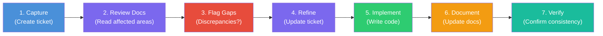

# sdlc-baseline

**A lightweight, GitHub-native development lifecycle for solo devs and AI-assisted teams.**

No heavyweight tools. No enterprise bloat. Just a clear, repeatable process built on GitHub Issues, Projects, and a discipline that treats documentation as a first-class deliverable.

---

## What's Included

| Artifact | Purpose |
|----------|---------|
| [`CLAUDE-TEMPLATE.md`](CLAUDE-TEMPLATE.md) | Drop-in CLAUDE.md workflow section for any project |
| [`docs/workflow.md`](docs/workflow.md) | The 7-step ticket-first development workflow |
| [`docs/roles.md`](docs/roles.md) | Role definitions and AI collaboration model |
| [`docs/board-setup.md`](docs/board-setup.md) | GitHub Projects board creation guide |
| [`docs/labels.md`](docs/labels.md) | Label taxonomy with `gh` CLI setup commands |
| [`docs/commit-conventions.md`](docs/commit-conventions.md) | Commit, PR, and branch naming conventions |
| [`docs/definition-of-done.md`](docs/definition-of-done.md) | Definition of Done checklists by issue type |
| [`docs/severity-matrix.md`](docs/severity-matrix.md) | Bug severity and priority matrix |
| [`docs/testing-placeholder.md`](docs/testing-placeholder.md) | Testing strategy stub — decisions to make per project |
| [`.github/ISSUE_TEMPLATE/`](.github/ISSUE_TEMPLATE/) | Issue templates: feature, bug, chore, docs |
| [`.github/PULL_REQUEST_TEMPLATE.md`](.github/PULL_REQUEST_TEMPLATE.md) | PR checklist template |
| [`scripts/setup-labels.sh`](scripts/setup-labels.sh) | Automate label creation via `gh` CLI |

## Quick Start

**1. Copy the files into your project**

```bash
# Clone this repo
git clone https://github.com/Johnesco/sdlc-baseline.git

# Copy what you need into your project
cp sdlc-baseline/CLAUDE-TEMPLATE.md your-project/CLAUDE.md
cp -r sdlc-baseline/.github your-project/
```

**2. Set up your GitHub Projects board**

Follow [`docs/board-setup.md`](docs/board-setup.md) to create a 6-column kanban board:
**Backlog** | **Refining** | **Ready** | **In Progress** | **Verify** | **Done**

**3. Start building**

Every change follows the same cycle: ticket first, build, document, verify.

---

## Workflow at a Glance

Every change follows the 7-step ticket-first workflow:



> **Key rule:** No code without a ticket. A change without a documentation update is incomplete.

See [`docs/workflow.md`](docs/workflow.md) for the full guide with examples.

---

## Roles

This process supports a solo developer wearing multiple hats, optionally assisted by an AI coding agent (like Claude).

| Role | Typical Owner | Responsibilities | Board Columns |
|------|---------------|------------------|---------------|
| **PO** (Product Owner) | Human | Prioritize backlog, accept completed work | Backlog, Done |
| **BA** (Business Analyst) | Human or AI | Scope requirements, write acceptance criteria | Refining, Ready |
| **Dev** (Developer) | AI (primary) or Human | Write code, reference tickets in commits | In Progress |
| **Documenter** | AI (bundled with Dev) | Update specs, CLAUDE.md, README | In Progress |
| **QA** (Quality Assurance) | **Human (always)** | Verify completed work, acceptance testing | Verify |

> **The most important rule:** Claude cannot QA its own work. The Verify column is always human-owned.

See [`docs/roles.md`](docs/roles.md) for detailed role definitions and "hat-switch" guidance.

---

## Board Columns

```
 Backlog  -->  Refining  -->  Ready  -->  In Progress  -->  Verify  -->  Done
   (PO)         (BA)          (BA)         (Dev)           (QA)        (PO)
```

| Column | What's Here | Moved By |
|--------|-------------|----------|
| **Backlog** | Captured but not yet scoped | Auto (on issue create) |
| **Refining** | Defining scope and requirements | Manual |
| **Ready** | Acceptance criteria finalized, ready to build | Manual |
| **In Progress** | Actively being coded | Manual |
| **Verify** | Code complete, awaiting human testing | Manual |
| **Done** | Verified and accepted | Auto (on issue close) |

---

## AI Collaboration Model

This is not just a process document — it's a **human-AI collaboration framework**. Here's what makes it different:

### What the AI does well
- **Dev + Documenter**: Writes code and updates documentation in the same commit
- **BA assist**: Helps scope tickets, identifies affected areas, drafts acceptance criteria
- **Consistency enforcer**: Follows the 7-step workflow without skipping steps
- **Pattern matcher**: Applies project conventions consistently across files

### What the human must do
- **Verify**: AI cannot test its own output. Every `Verify` column item needs human eyes.
- **Prioritize**: Decide what gets built and in what order
- **Accept**: Confirm that delivered work matches intent
- **Course-correct**: Catch when AI is heading in the wrong direction

### How to signal role changes

When working with an AI assistant, explicitly state which hat you're wearing:

```
"Wearing my PO hat — let's prioritize the backlog."
"Switching to BA — help me scope this feature."
"Dev mode — implement ticket #12."
"QA time — I'm going to verify what you built."
```

This prevents the AI from guessing your intent and keeps the workflow predictable.

---

## Adoption Paths

### New Project
1. Copy `CLAUDE-TEMPLATE.md` as your `CLAUDE.md`
2. Fill in the project-specific sections (identity, file structure, patterns)
3. Copy `.github/` templates
4. Create your Projects board ([guide](docs/board-setup.md))
5. Create labels ([guide](docs/labels.md))
6. Start building with the ticket-first workflow

### Existing Project
1. Copy the workflow section from `CLAUDE-TEMPLATE.md` into your existing `CLAUDE.md`
2. Add the issue templates to `.github/ISSUE_TEMPLATE/`
3. Create a Projects board and add existing issues
4. Adopt the workflow going forward (no need to retrofit)

### Minimal (Just the Workflow)
1. Read [`docs/workflow.md`](docs/workflow.md)
2. Follow the 7 steps mentally, even without the full setup
3. Add structure incrementally as you feel the need

---

## Tested in Production

This process was developed and battle-tested while building the [Austin Karaoke Directory](https://github.com/Johnesco/karaokedirectory) — a vanilla JavaScript web app with 70+ venues, multiple views, and a full documentation portal.

Every pattern in this repo was extracted from real usage:
- The `gh project item-add` gotcha? Discovered after 5 issues silently missed the board.
- The "Claude cannot QA its own work" rule? Learned the hard way.
- The 7-step workflow? Refined over dozens of tickets across months of development.

---

## License

[MIT](LICENSE) — Use it, adapt it, make it yours.
