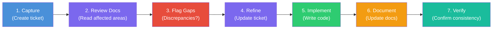

# sdlc-baseline

**A lightweight, GitHub-native development lifecycle for solo devs and AI-assisted teams.**

No heavyweight tools. No enterprise bloat. Just a clear, repeatable process built on GitHub Issues, Projects, and a discipline that treats documentation as a first-class deliverable.

**Two profiles, one standard.** Every doc is tagged `core` or `ops`. `core` is every project — a game on itch.io, a desktop app, a library. `core+ops` adds deployment, CI/CD and incident response for projects that run a service. Declare it in one line in `CLAUDE.md`; undeclared means core. See [`docs/profiles.md`](docs/profiles.md).

---

> **New to working this way?** Open [`docs/start-here.html`](docs/start-here.html) in a browser. It is the orientation layer — why a process is worth it when you are one person, the loop, the three non-negotiables, and a first week that doesn't try to adopt everything at once. It is the only document here meant to be read front to back.

## How to Consume

**Treat sdlc-baseline as a library, not a starter kit.** Reference canonical docs from your project's `CLAUDE.md`; vendor only the small set of files GitHub's tooling reads from fixed paths. See [`docs/consumption.md`](docs/consumption.md) for the full model and rationale.

When sdlc-baseline ships changes, [`CHANGELOG.md`](CHANGELOG.md) is the human-facing signal — glance at it before adopting changes downstream.

## What's Included

The **Type** column tells you how to consume each artifact:

- **🔁 Vendored** — must be copied into your project: GitHub's tooling reads it from a fixed path, or it runs from inside your repo
- **🔗 Referenced** — link to the canonical version from your project; never copy
- **📋 Template** — copy-paste source you adapt per project

### Core — every project

| Artifact | Type | Purpose |
|----------|------|---------|
| [`CLAUDE-TEMPLATE.md`](CLAUDE-TEMPLATE.md) | 📋 Template | Slim CLAUDE.md skeleton — declares the profile; copy and customize once per project |
| [`docs/start-here.html`](docs/start-here.html) | 🔗 Referenced | Orientation for anyone new to working inside an SDLC — read this one front to back |
| [`docs/profiles.md`](docs/profiles.md) | 🔗 Referenced | The two profiles: manifest, what core relaxes and keeps, how to declare and upgrade |
| [`docs/consumption.md`](docs/consumption.md) | 🔗 Referenced | How downstream projects consume sdlc-baseline (vendored vs referenced) |
| [`docs/workflow.md`](docs/workflow.md) | 🔗 Referenced | The 7-step ticket-first workflow, with the decide-before-you-build gate |
| [`docs/roles.md`](docs/roles.md) | 🔗 Referenced | Role definitions and AI collaboration model |
| [`docs/definition-of-done.md`](docs/definition-of-done.md) | 🔗 Referenced | Definition of Done checklists by issue type — verification-first |
| [`docs/severity-matrix.md`](docs/severity-matrix.md) | 🔗 Referenced | Bug severity and priority matrix |
| [`docs/commit-conventions.md`](docs/commit-conventions.md) | 🔗 Referenced | Commit, PR, and branch naming conventions |
| [`docs/release-management.md`](docs/release-management.md) | 🔗 Referenced | Versioning, build numbers, releases, changelogs, hotfixes, milestones |
| [`docs/testing.md`](docs/testing.md) | 🔗 Referenced | Testing strategy and the local gate |
| [`docs/backlog-hygiene.md`](docs/backlog-hygiene.md) | 🔗 Referenced | Review cadence, grooming tactics, planning without sprints |
| [`docs/adrs.md`](docs/adrs.md) | 🔗 Referenced | ADR protocol, threshold rule, the six-line stub |
| [`docs/security-basics.md`](docs/security-basics.md) | 🔗 Referenced | Secrets, dependencies, XSS; server-only sections marked `(ops)` |
| [`docs/board-setup.md`](docs/board-setup.md) | 🔗 Referenced | GitHub Projects board — if you use one |
| [`docs/labels.md`](docs/labels.md) | 🔗 Referenced | Label taxonomy with `gh` CLI setup commands |
| [`docs/kickoff-checklist.md`](docs/kickoff-checklist.md) | 🔗 Referenced | Day-1 setup guide for new and existing projects |
| [`CHANGELOG.md`](CHANGELOG.md) | 🔗 Referenced | Release notes for downstream projects |

### Ops — add for projects that run a service

| Artifact | Type | Purpose |
|----------|------|---------|
| [`docs/deployment.md`](docs/deployment.md) | 🔗 Referenced | Deploy patterns, environments, config/secrets, rollback |
| [`docs/ci-cd.md`](docs/ci-cd.md) | 🔗 Referenced | CI/CD pipelines, GitHub Actions, starter workflows, branch protection |
| [`docs/incident-response.md`](docs/incident-response.md) | 🔗 Referenced | Production incidents: detect, restore, investigate, prevent |

### Vendored files and templates (both profiles)

| Artifact | Type | Purpose |
|----------|------|---------|
| [`.github/ISSUE_TEMPLATE/`](.github/ISSUE_TEMPLATE/) | 🔁 Vendored | Issue templates (GitHub UI reads them from `.github/`) |
| [`.github/PULL_REQUEST_TEMPLATE.md`](.github/PULL_REQUEST_TEMPLATE.md) | 🔁 Vendored | PR checklist — for when you use PRs |
| [`scripts/setup-labels.sh`](scripts/setup-labels.sh) | 🔁 Vendored | Runs against the consuming repo's labels |
| [`scripts/sync-github-templates.sh`](scripts/sync-github-templates.sh) | 🔁 Vendored | Pulls the latest vendored files; copied verbatim and run from your repo — nothing to adapt |
| [`examples/CLAUDE-example.md`](examples/CLAUDE-example.md) | 📋 Template | Worked example of a slim, core-profile CLAUDE.md |
| [`examples/functional-spec-template.md`](examples/functional-spec-template.md) | 📋 Template | Blank functional specification skeleton |
| [`examples/adr-stub.md`](examples/adr-stub.md) | 📋 Template | The six-line ADR stub written before code |
| [`examples/adr-template.md`](examples/adr-template.md) | 📋 Template | Copy-paste ADR skeleton (Nygard format) |
| [`examples/adr-example.md`](examples/adr-example.md) | 📋 Template | A worked ADR example from a real project |

## Quick Start

> **Using Claude Code?** Paste the [Quick Launch prompt](docs/kickoff-checklist.md#quick-launch) into your first session and Claude handles the setup.
>
> For the full step-by-step walkthrough (including the ops phases), see [`docs/kickoff-checklist.md`](docs/kickoff-checklist.md).

**1. Vendor the files GitHub's tooling needs**

```bash
# Clone this repo
git clone https://github.com/Johnesco/sdlc-baseline.git

# Copy the slim template + the vendored artifacts (GitHub UI reads these
# from fixed paths — they have to live in your repo)
cp sdlc-baseline/CLAUDE-TEMPLATE.md your-project/CLAUDE.md
cp -r sdlc-baseline/.github your-project/
cp sdlc-baseline/scripts/setup-labels.sh your-project/scripts/
cp sdlc-baseline/scripts/sync-github-templates.sh your-project/scripts/
```

Customize `CLAUDE.md` with your project identity, file structure, milestones, and project IDs. Do **not** paste any sdlc-baseline process docs into it — `CLAUDE.md` already links to them.

When sdlc-baseline updates, run `bash scripts/sync-github-templates.sh` to pull the latest vendored artifacts. Everything else updates automatically by virtue of being linked, not copied.

**2. Optional — set up a GitHub Projects board**

Core projects can skip this: `gh issue list --state open` is the board. If you want one, follow [`docs/board-setup.md`](docs/board-setup.md) to create a 5-column kanban board:
**Backlog** | **Ready** | **In Progress** | **Verify** | **Done**

**3. Start building**

Every change follows the same cycle: ticket first, decide, build, document, verify.

---

## Workflow at a Glance

Every change follows the 7-step ticket-first workflow:


```mermaid
flowchart LR
    A["1. Capture\n(Create ticket)"] --> B["2. Review Docs\n(Read affected areas)"]
    B --> C["3. Flag Gaps\n(Discrepancies?)"]
    C --> D["4. Refine\n(Update ticket)"]
    D --> E["5. Implement\n(Write code)"]
    E --> F["6. Document\n(Update docs)"]
    F --> G["7. Verify\n(Confirm consistency)"]

    style A fill:#4a90d9,color:#fff
    style B fill:#7b68ee,color:#fff
    style C fill:#e74c3c,color:#fff
    style D fill:#7b68ee,color:#fff
    style E fill:#2ecc71,color:#fff
    style F fill:#f39c12,color:#fff
    style G fill:#1abc9c,color:#fff
```

> **Key rules:** No code without a ticket. No build without a decision. A change without a documentation update is incomplete.

See [`docs/workflow.md`](docs/workflow.md) for the full guide with examples.

---

## Roles

This process supports a solo developer wearing multiple hats, optionally assisted by an AI coding agent (like Claude).

| Role | Typical Owner | Responsibilities | Board Columns (if used) |
|------|---------------|------------------|---------------|
| **PO** (Product Owner) | Human | Prioritize backlog, accept completed work | Backlog, Done |
| **BA** (Business Analyst) | Human or AI | Scope requirements, write acceptance criteria | Backlog (refinement), Ready |
| **Dev** (Developer) | AI (primary) or Human | Write code, reference tickets in commits | In Progress |
| **Documenter** | AI (bundled with Dev) | Update specs, CLAUDE.md, README | In Progress |
| **QA** (Quality Assurance) | **Human (always)** | Verify completed work, acceptance testing | Verify |

> **The most important rule:** Claude cannot QA its own work. The Verify column is always human-owned.

See [`docs/roles.md`](docs/roles.md) for detailed role definitions and "hat-switch" guidance.

---

## Board Columns (if you use a board)

```
 Backlog  -->  Ready  -->  In Progress  -->  Verify  -->  Done
  (PO/BA)       (BA)         (Dev)           (QA)        (PO)
```

| Column | What's Here | Moved By |
|--------|-------------|----------|
| **Backlog** | Captured; refinement happens here (doc review, scope, AC) | Auto (on issue create) |
| **Ready** | Acceptance criteria finalized, ready to build | Manual |
| **In Progress** | Actively being coded | Manual |
| **Verify** | Code complete, awaiting human testing | Manual |
| **Done** | Verified and accepted | Auto (on issue close) |

---

## Labels

Four categories, 20 labels total. See [`docs/labels.md`](docs/labels.md) for full details and `gh` CLI setup commands.

| Category | Labels | Rule |
|----------|--------|------|
| **Type** | `feature`, `bug`, `docs`, `task`, `spike` | Exactly one per issue |
| **Area** | `area:frontend`, `area:backend`, `area:data`, `area:docs`, `area:infra`, `area:testing`, `area:design` | One or more (customize for your project) |
| **Priority** | `priority:high`, `priority:low` | At most one; no label = normal priority |
| **Resolution** | `resolution:wontfix`, `resolution:duplicate`, `resolution:cannot-reproduce`, `resolution:by-design`, `resolution:stale`, `resolution:superseded` | Applied when closing without completing; no label = completed |

---

## AI Collaboration Model

This is not just a process document — it's a **human-AI collaboration framework**. Here's what makes it different:

### What the AI does well
- **Dev + Documenter**: Writes code and updates documentation in the same commit
- **BA assist**: Helps scope tickets, identifies affected areas, drafts acceptance criteria
- **Consistency enforcer**: Follows the 7-step workflow without skipping steps
- **Pattern matcher**: Applies project conventions consistently across files

### What the human must do
- **Verify**: AI cannot test its own output. Every `Verify` column item needs human eyes.
- **Prioritize**: Decide what gets built and in what order
- **Accept**: Confirm that delivered work matches intent
- **Course-correct**: Catch when AI is heading in the wrong direction

### How to signal role changes

When working with an AI assistant, explicitly state which hat you're wearing:

```
"Wearing my PO hat — let's prioritize the backlog."
"Switching to BA — help me scope this feature."
"Dev mode — implement ticket #12."
"QA time — I'm going to verify what you built."
```

This prevents the AI from guessing your intent and keeps the workflow predictable.

---

## Adoption Paths

### New Project
1. Copy `CLAUDE-TEMPLATE.md` as your `CLAUDE.md`
2. Declare your profile in `CLAUDE.md` — `core` unless the project runs a service ([guide](docs/profiles.md))
3. Fill in the project-specific sections (identity, file structure, patterns)
4. Copy `.github/` templates
5. Create your Projects board — optional in core ([guide](docs/board-setup.md))
6. Create labels ([guide](docs/labels.md))
7. Start building with the ticket-first workflow

### Existing Project
1. Copy the workflow section from `CLAUDE-TEMPLATE.md` into your existing `CLAUDE.md`
2. Declare your profile in `CLAUDE.md` ([guide](docs/profiles.md))
3. Add the issue templates to `.github/ISSUE_TEMPLATE/`
4. Optional: create a Projects board and add existing issues
5. Adopt the workflow going forward (no need to retrofit)

### Minimal (Just the Workflow)
1. Read [`docs/workflow.md`](docs/workflow.md)
2. Follow the 7 steps mentally, even without the full setup
3. Add structure incrementally as you feel the need

---

## Tested in Production

Two projects shaped this standard.

The [Austin Karaoke Directory](https://github.com/Johnesco/karaokedirectory) — a vanilla JavaScript web app with 70+ venues, multiple views, and a full documentation portal — is where the process was born. The `gh project item-add` gotcha was discovered after 5 issues silently missed the board; "Claude cannot QA its own work" was learned the hard way; the 7-step workflow was refined over dozens of tickets across months of development.

Pavement Pursuit (private repo) — a browser racing game shipped to itch.io as numbered builds — never adopted this standard and out-shipped every project that did: 500+ commits, 50+ ADRs, 27 tagged builds, one test command, no board, no CI. It is the source of the *decide before you build* rule, the local gate, and the build-number versioning model. The core profile exists so a project like it can adopt this standard without taking on the ops layer.

---

## License

[MIT](LICENSE) — Use it, adapt it, make it yours.
